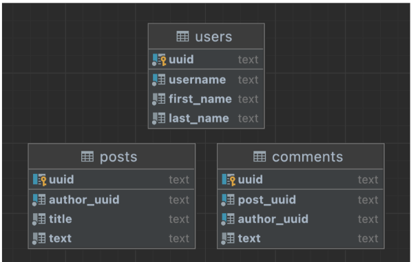

1. Создайте таблицы для хранения статей и комментариев в БД SQLite: 
   1.  Таблица статей должна иметь колонки: UUID статьи, UUID автора статьи, заголовок, текст. 
   2. Таблица комментариев должна иметь колонки: UUID комментария, UUID статьи, UUID автора комментария, текст. 
)
1.  Обновите классы пользователей, статей и комментариев так, чтобы их идентификаторы имели тип UUID.
2. Создайте интерфейсы репозиториев статей и комментариев — PostsRepositoryInterface и CommentsRepositoryInterface. Контракты должны иметь по два метода:
get — принимающий UUID и возвращающий объект статьи или комментария.
save — принимающий объект статьи или комментария и ничего не возвращающий.